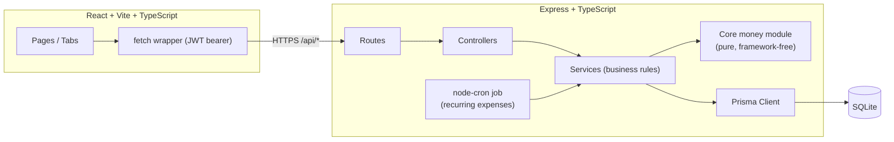
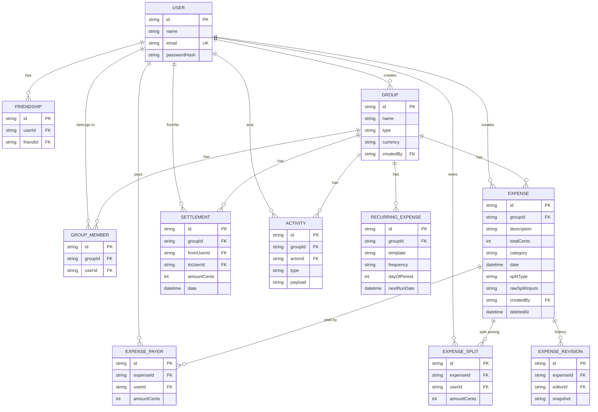

# Expense Splitter

A local, Splitwise-style expense-sharing app: create groups, log shared
expenses with any split type, and let a debt-simplification algorithm turn a
tangle of IOUs into the smallest set of payments that settles everyone up.

## Screenshots

_Placeholders — capture these screens and drop the images in `docs/screenshots/`,
then link them here:_

1. **Login page** showing the demo login buttons
2. **Dashboard** with overall balance, group cards and recent activity
3. **Group → Expenses tab** with a mix of split types and multi-payer rows
4. **Add expense form** with the live split preview visible (try a Shares split)
5. **Group → Balances tab** with the "Simplify debts" toggle on, showing suggested payments
6. **Settle-up form** pre-filled from a suggested payment
7. **Group → Insights tab** showing the category/month spending chart
8. **Expense detail page** showing edit history after one edit

## Features

- **Groups** — Home/Trip/Couple/Other, single currency per group, add/remove members (blocked while a member has a non-zero balance)
- **Expenses** — description, category, notes, one or multiple payers, four split types (Equal, Exact, Percentage, Shares), edit history, soft delete + restore
- **Balances** — net balance per member, raw pairwise debts, and a one-click "simplify debts" toggle
- **Settlements** — record a payment (full or partial), "Settle up" pre-fills the suggested amount
- **Recurring expenses** — e.g. "Rent, 1st of every month, split equally", materialized by a daily cron job
- **Activity feed** — per group, and folded into a per-user feed on the dashboard
- **Insights** — spending by category per month (chart), paid-vs-share per member, CSV ledger export
- **Auth** — JWT + bcrypt, demo login buttons for local seeded users
- **Authorization** — only group members can see or modify a group's data (non-members get 404)

## Architecture



Routes handle HTTP only; controllers parse/validate with zod and call
services; services hold all business rules and are the only layer that talks
to Prisma; the split/rounding/debt-simplification math lives in a pure
`core/` module with no framework or database dependency, so it's unit- and
property-tested in isolation.

## Data model



## Design decisions & trade-offs

**Money as integer cents, never floating point.** `0.1 + 0.2 !== 0.3` in
IEEE‑754 floats, and compounding that error across dozens of expenses and
splits would eventually make balances not add up — unacceptable for a ledger.
Every amount is an integer number of cents from the HTTP boundary (zod
validates `z.number().int()`) through the database (`Int` columns) to the
arithmetic. Dollars only exist at the UI edges, converted with
`Math.round(dollars * 100)`.

**Largest remainder method, with a deterministic tie-break.** Splitting
$100.00 three ways gives 33.333... each — you can't hand out a third of a
cent. The algorithm: give everyone `floor(share)`, then hand the leftover
cents one at a time to whoever has the largest fractional remainder. Ties
(equal remainders, as in an equal 3-way split) are broken by ascending member
id, so the *same* member gets the extra cent every time the same input is
recomputed — important both for user trust ("why did my share change?") and
for deterministic tests. See `server/src/core/money/rounding.ts`.

**Debt simplification: greedy, not optimal — and why.** Raw pairwise debts
from N expenses can leave up to N(N-1)/2 IOUs even among a handful of people.
The simplifier repeatedly matches the largest creditor with the largest
debtor and settles the smaller of the two amounts, which provably terminates
in at most n-1 payments for n members (each match fully zeroes out at least
one person). Finding the *true minimum* number of payments is NP-hard — it
reduces to a variant of the subset-sum/bin-covering problem — so an exact
solver doesn't scale past a handful of members. The greedy approximation is
what every production tool in this space (including Splitwise) actually
ships, and it's `O(n² log n)` here. See `server/src/core/simplifyDebts.ts`.

**Property-based testing.** Example-based tests ("100 split 3 ways is
33.34/33.33/33.33") catch the cases you thought of. Property-based tests
(via `fast-check`) instead assert invariants that must hold for *any* input
and let the library search for counterexamples:
1. net balances across a group always sum to exactly zero (money is
   conserved — nothing is created or destroyed by a split);
2. applying the simplified payments always settles every balance to zero;
3. simplification never produces more than n-1 payments.
These ran against thousands of randomly generated groups/expenses in CI and
found real rounding bugs during development that example tests missed.

**Soft deletes and revision history keep balances auditable.** Expenses are
never hard-deleted or overwritten in place: `deletedAt` marks a delete
(excluded from balance queries, restorable), and every edit first snapshots
the pre-edit state into `ExpenseRevision` before applying the change. This
means a balance can always be explained by replaying real history, disputes
("didn't I already pay for this?") have an answer, and nothing is
irreversibly lost to a typo.

## How to run

Prerequisites: Node 20+.

```bash
cd server && cp .env.example .env && npm install && npm run migrate && npm run seed
```
```bash
npm run dev
```
```bash
cd ../client && npm install && npm run dev
```

Open http://localhost:5173 — that's 5 commands total (4 setup + `npm run dev`
in each of two terminals). The client proxies `/api` to `http://localhost:5000`.

### Demo accounts

Any seeded user's password is `password123`. The login page has one-click
buttons for three of them:

| Name | Email | Group |
|---|---|---|
| Ali Khan | ali@example.com | Flatmates |
| Omar Farooq | omar@example.com | Thailand Trip |
| Sara Ahmed | sara@example.com | Office Lunch |

Five more seeded users (Bilal, Fatima, Ayesha, Hamza, Zara) share the same
password and can be used to test cross-group friendships.

### Useful server scripts

```bash
npm run migrate        # apply Prisma migrations
npm run seed            # reset + seed demo data (8 users, 3 groups, ~90 expenses)
npm run reset            # drop, recreate and reseed the dev database
```

## Running the tests

```bash
cd server
npm test
```

This runs unit tests (money/rounding/split/simplify/recurrence), property
tests (fast-check invariants), and Supertest integration tests against a
separate SQLite test database (`.env.test`), migrated automatically via the
`pretest` script. Everything is deterministic and runs with one command —
no real clock, network, or manual setup required.

```bash
cd client
npm run build   # type-checks and production-builds the frontend
```

## Project structure

```
expense-splitter/
├── server/
│   ├── prisma/            schema, migrations, seed script
│   ├── src/
│   │   ├── core/           pure money + recurrence logic (no framework/DB)
│   │   ├── modules/        auth, friends, groups, expenses, balances,
│   │   │                   settlements, recurring, activity, insights, me
│   │   │                   (each: routes → controller → service)
│   │   ├── middleware/     authGuard, errorHandler
│   │   ├── jobs/           node-cron recurring-expenses job
│   │   └── db/             Prisma client
│   └── tests/              unit/, property/, integration/
├── client/
│   └── src/
│       ├── api/             typed fetch wrappers per feature
│       ├── pages/            Dashboard, Login, Register, Group (tabs), Expense form/detail
│       ├── context/          auth context
│       ├── charts/           Chart.js insights chart
│       └── lib/               money formatting, client-side split preview
├── docs/API.md
├── PROJECT_SUMMARY.md
└── .github/workflows/ci.yml
```

## Known limitations & future improvements

- **Single currency per group** — no FX conversion; a future version could
  store expenses in their original currency and convert for display.
- **No real-time updates** — balances refresh on navigation/action, not via
  websockets; fine for a small group, not for large concurrent groups.
- **No pagination** — activity feed and expense lists are capped (e.g. 100
  activity entries) rather than paginated; would need cursor-based paging at
  scale.
- **Recurring expenses only support Equal split** in the UI (the API
  accepts any split type in the template) — a richer recurring-expense form
  is a natural next step.
- **No image/receipt attachments** — expenses are text-only.
- **No email notifications** for new expenses, settlements or reminders.
- **Single free-form currency code** — not validated against ISO 4217, so a
  group could technically be created with a nonsense 3-letter code.
